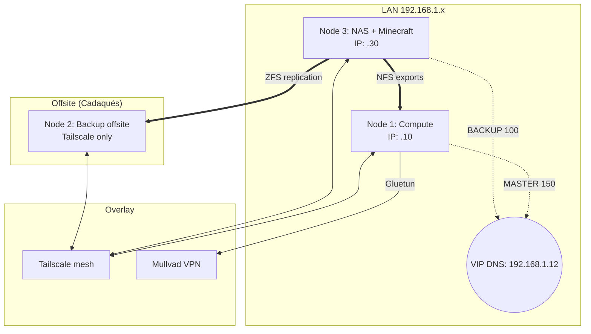

# 🧠 Homelab: Infraestructura self‑hosted de 3 nodos

## Por qué monté este homelab

Monté este homelab para dejar de depender de Google Photos, Netflix y otros servicios de suscripción, y para tener un entorno real donde aprender redes, Linux y administración de sistemas. Todo empezó cuando un manager me dejó llevarme un mini PC a casa para trastear sin presión; desde ahí he ido evolucionando hacia un clúster de 3 nodos donde alojo mis fotos, documentos, medios, contraseñas y un servidor de Minecraft para amigos.

---

## 🌐 Topología general y HA DNS

En la red local uso una VIP (`192.168.1.12`) gestionada con **Keepalived** para tener DNS en alta disponibilidad: Node 1 actúa como MASTER y Node 3 como BACKUP. Tengo un script sencillo que comprueba AdGuard en el puerto 53 y, si falla en el nodo activo, fuerza el failover al otro.

Todos los nodos están unidos por **Tailscale** (para acceso remoto seguro), y el stack de descargas en Node 1 sale por **Gluetun + Mullvad** para no exponer la IP real del hogar.

---

## 🖥️ Nodos de hardware

| Rol | Hardware | RAM | Almacenamiento | Sistema |
| :--- | :--- | :--- | :--- | :--- |
| Node 1 – Compute | HP Elite Slice G2 (i5‑7500T) | 32GB | 1TB NVMe | Debian 13 |
| Node 2 – Backup offsite | Lenovo ThinkCentre M600 Tiny | 4GB | 1TB HDD (ZFS) | Debian 13 |
| Node 3 – NAS + Game server | AOOSTAR WTR PRO (Ryzen 7 5825U) | 48GB | 4x SATA, 2x NVMe | Debian 13 |

Node 1 se centra en compute y orquestación Docker.  
Node 3 es mi NAS principal y servidor de juegos.  
Node 2 está en otra ubicación física, conectado solo por Tailscale, y se dedica a recibir copias de seguridad.

---

## 🎬 Servicios principales (lo que uso en el día a día)

Los servicios los orquesto con Dockge en stacks separados, pero lo importante es qué hacen:

- **Jellyfin** – Es básicamente mi “Netflix/Prime Video” personal: streaming de pelis y series desde el NAS, con transcodificación por hardware (QSV) cuando hace falta.
- **Immich** – reemplaza Google Photos. Todas mis fotos y vídeos van a Immich sobre ZFS, con snapshots y réplicas. Tengo acceso desde el móvil y puedo buscar por personas, fechas, etc.
- **Vaultwarden** – gestor de contraseñas self‑hosted, accesible por Tailscale y protegido con 2FA.
- **AdGuard Home (x2)** – DNS y bloqueo de anuncios a nivel de red. Una instancia en Node 1 y otra en Node 3, coordinadas con Keepalived para alta disponibilidad.
- **Paperless‑ngx** – gestor documental para PDFs. Combino OneDrive + Syncthing + Paperless: OneDrive guarda los documentos, Syncthing los sincroniza al NAS y Paperless hace OCR y los indexa.
- **Obsidian LiveSync** – sincronización cifrada extremo a extremo de mis notas.
- **n8n** – motor de automatización que uso para alertas de hardware, notificaciones y tareas periódicas.
- **Navidrome / Deemix** – biblioteca musical y streaming, con descarga automatizada de música.

Además de esto, tengo otros servicios auxiliares (Scrutiny para SMART, dashboards, etc.), pero lo esencial es que todo lo importante (fotos, docs, contraseñas, media) vive aquí.

---

## 🗄️ Almacenamiento: ZFS y regla 3‑2‑1

Toda la parte de almacenamiento vive en **Node 3**, usando **ZFS**. ZFS me da checksums de integridad, snapshots y compresión automática, lo que me permite detectar y evitar corrupción silenciosa y mantener versiones históricas de datasets.

Principales pools:

- `fast_pool` (mirror SSD) – datasets críticos de Immich y Paperless.
- `media_pool` (HDD) – contenido multimedia; lo exporto por NFS a Node 1.
- `cold_backup` (HDD) – backups fríos locales de Immich.
- `minepool` (NVMe dedicado) – pool ZFS aislado para el servidor de Minecraft.

Para seguir la regla **3‑2‑1** (3 copias, 2 medios, 1 fuera de casa):

- Tengo los datos en Node 3 (ZFS).
- Hago snapshots automáticos (Sanoid).
- Replico datasets importantes (por ejemplo, Immich) a **Node 2** usando Syncoid sobre Tailscale. Node 2 está fuera de mi casa, con ZFS también, así tengo copias offsite con verificación de integridad.
- Si algo va mal en los pools (errores de ZFS o SMART), tengo scripts que envían alertas a Telegram vía n8n para enterarme rápido.

---

## 🛡️ Seguridad actual (router, UFW, CrowdSec)

No busco un setup paranoico, pero sí quiero tener lo mínimo serio montado.

### Router

En el router solo tengo un port forwarding:

- Puerto 25565 TCP/UDP hacia Node 3 para el servidor de Minecraft.

No expongo otros servicios directamente a internet; el resto se ve solo desde la LAN o por Tailscale.

### UFW en Node 3

En Node 3 uso UFW con:

- Incoming: **deny** por defecto.
- Outgoing: **allow** por defecto.

Y reglas explícitas para:

- Permitir todo desde la LAN `192.168.1.0/24` (uso normal de casa).
- Permitir SSH solo desde la red Tailscale `100.64.0.0/10`.
- Permitir el puerto 25565 TCP/UDP (Minecraft) para conexiones externas.

Con esto:

- Minecraft sigue accesible desde fuera.
- La administración del nodo (SSH) va solo por LAN o Tailscale.
- Cualquier servicio nuevo que exponga puertos queda bloqueado hasta que yo decida abrirlo.

### CrowdSec

Tengo CrowdSec instalado en Node 3 analizando logs (por ejemplo SSH). Cuando detecta comportamientos sospechosos, añade las IPs a listas negras en el firewall. Yo sigo accediendo normal a mis servicios, pero las direcciones que CrowdSec marca como maliciosas dejan de poder conectar.

---

## 📝 Documentos y flujo con OneDrive

Toda mi documentación personal la guardo en OneDrive. En el homelab:

- Uso **Syncthing** para sincronizar automáticamente esos documentos desde OneDrive a un directorio del NAS.
- **Paperless‑ngx** vigila ese directorio, hace OCR y etiqueta los PDFs.

Así puedo buscar documentos por contenido (palabras dentro del PDF) y no por nombre de archivo, y tengo mis papeles centralizados y respaldados en ZFS, con snapshots y replicación.

---

## 🎮 Servidor de Minecraft

En Node 3 tengo un servidor de Minecraft para amigos:

- Lo gestiono con **Crafty Controller** en Docker (panel web, backups, logs).
- El mundo vive en `minepool/crafty` (ZFS sobre NVMe dedicado) con quota de 50GB para no competir con Immich y el resto.
- A nivel de configuración del juego:
  - Whitelist activa.
  - `online-mode=true` para verificar cuentas oficiales.
  - `prevent-proxy-connections=true` para complicar el uso de proxies.

A nivel de red y seguridad:

- Solo el puerto 25565 está expuesto en el router.
- UFW controla qué puertos están abiertos en Node 3.
- CrowdSec vigila los intentos sospechosos y manda IPs problemáticas al firewall.

Inicialmente el ISP me tenía tras CGNAT y el port forwarding no funcionaba aunque estuviera bien hecho; lo solucioné pidiendo una IP pública exclusiva (no fija, pero enrutable). Una vez activa, el servidor quedó accesible desde un dominio propio en Cloudflare en modo DNS only.

---

Uso este homelab como entorno de aprendizaje continuo y como forma de depender menos de servicios externos. Cada nueva pieza que añado intento integrarla siguiendo buenas prácticas de almacenamiento, red y seguridad.